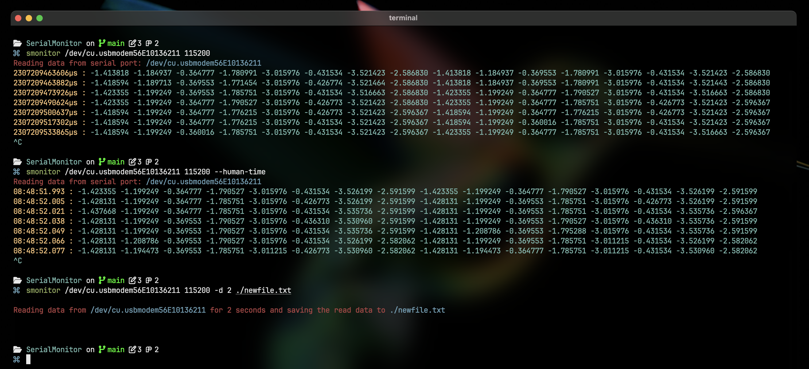

# SerialMonitor

SerialMonitor is a continuation and fork of a custom tool I developed for
[Haemograph Pyt. Ltd.](https://github.com/Haemograph-Rheometer/) to monitor the firmware I worked
on. It has now been improved to serve as a more general tool for reading from the Serial Monitor and
recording logs.

## Usage



```
$ smonitor [port] [baud rate] {file.txt} -d {duration} --human-time

Options:
  port              Port to connect to (required)
  baud              Baud rate for serial communication (e.g., 9600, 19200)
  duration          Time in seconds for serial read. 0 for forever. (default 60)
  file              Path to the file.txt where logs will be saved

Flags:
  --human-time      Instead of µs, get time in hh:mm:ss.SSS

Example:
  $ monitor /dev/tty.usbmodem101 115200 -d 600 -o ./data.txt
  This command saves logs for 10 minutes in data.txt

  $ monitor /dev/tty.usbmodem101 9600 -d 0 --human-time
  This command prints serial data indefinitely with time in hh:mm:ss.SSS.

Notes:
  - Ensure the specified port is correct and accessible.
  - The duration is specified in seconds; use 0 for continuous logging, but it
    cannot be set to 0 when writing to a file.
  - The output file will be created if it does not exist, or overwritten if it does.
  - Logs are written to the file whenever a filename is specified.
  - Use the --ignore-values flag if you only want to log the timestamps.
```

